# Synthesis ECG signals via Generative adversarial networks


## Setup
```bash
pip install -r requirement.txt
```
## Usage
### [See data description](utils/README.md)
### download dataset

- option 1
```
sh download.sh
```
if you haven't install `unzip`, install `unzip` package first before run `download.sh`<br>
install guildline: <br>
[General](https://www.tecmint.com/install-zip-and-unzip-in-linux/) - for Linux<br>
[Homebrew](https://formulae.brew.sh/formula/unzip) - for MacOS 
- option 2:
    download from website 
    - [AF Classification from a Short Single Lead ECG Recording - The PhysioNet Computing in Cardiology Challenge 2017](https://physionet.org/content/challenge-2017/1.0.0/training2017.zip)
    - [MIT-BIH Arrhythmia Database](https://physionet.org/static/published-projects/mitdb/mit-bih-arrhythmia-database-1.0.0.zip)

### Process ECG signals
run following command 
```
python3 process_ecg.py
```
if you change the dataset path, modify `process_ecg.py` 
```python 3
# modify dataset path if necessary
AA_DATASET_DIR = 'AA_dataset/'   # MIT-BIH Arrhythmia Database
    
AF_DATASET_DIR = 'AF_dataset/'   # AF Classification from a Short Single Lead ECG Recording - The PhysioNet Computing in Cardiology Challenge 2017
LABEL_PATH = 'AF_dataset/REFERENCE-original.csv'

``` 
### GAN Training
training ECG signal with GAN model
```
python3 train.py
```

modify the input dataset path in `train.py` if you change the path of `X_train_af.pkl` and `y_af.pkl`
```
X_train = pickle.load(open("path_of_X_train_af.pkl", "rb"))  # --> load AF dataset
y = pickle.load(open("path_of_y_af.pkl", 'rb'))
```

## Output 
### MIT-BIH Arrhythmia Database
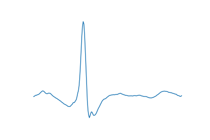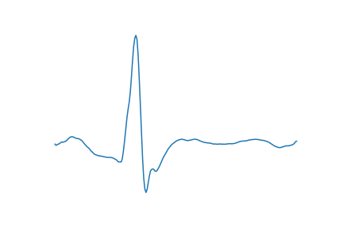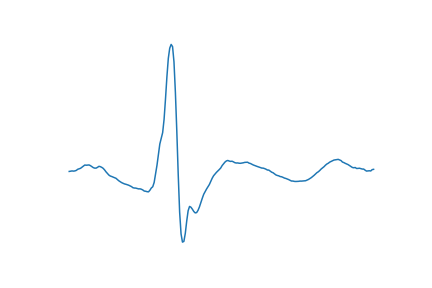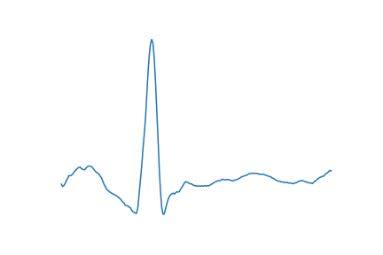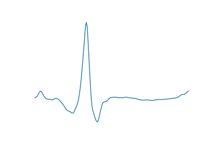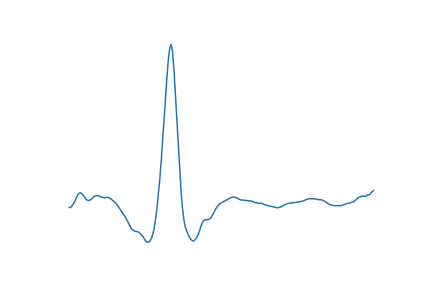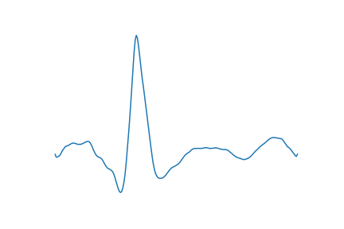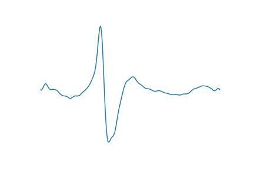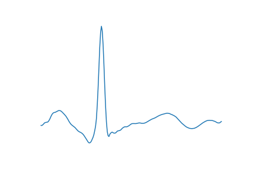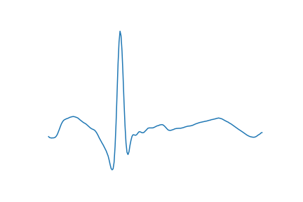

### Short Single Lead ECG Recording
#### Atrial Fibrillation
real <br>
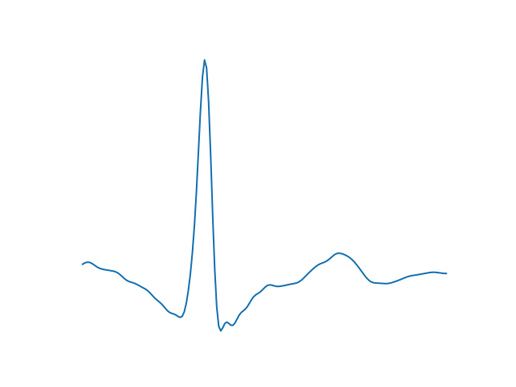
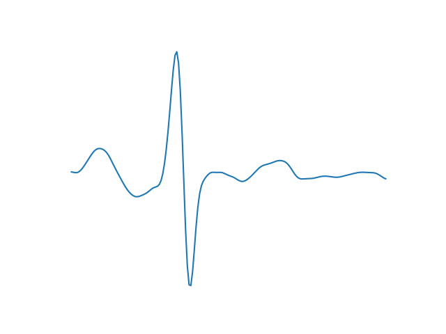
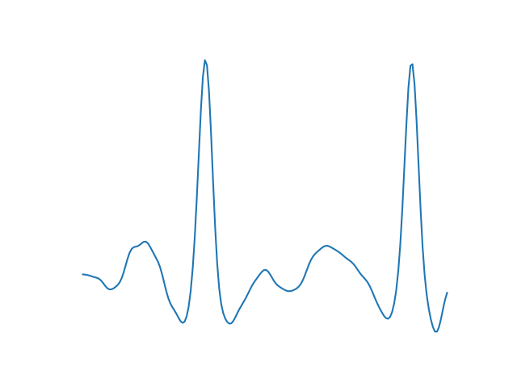 <br>
epoch 1000 <br>
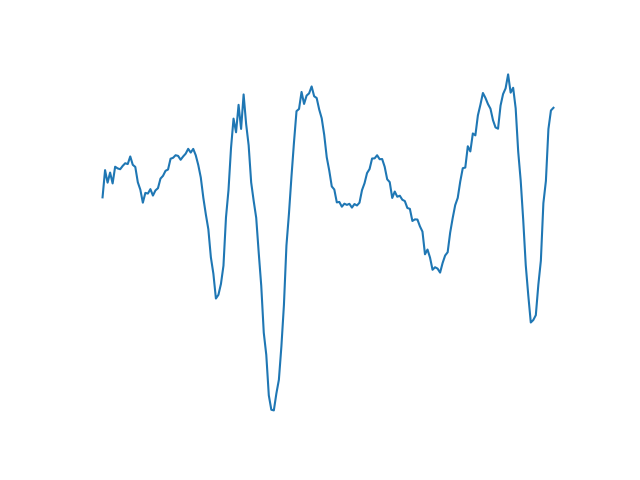
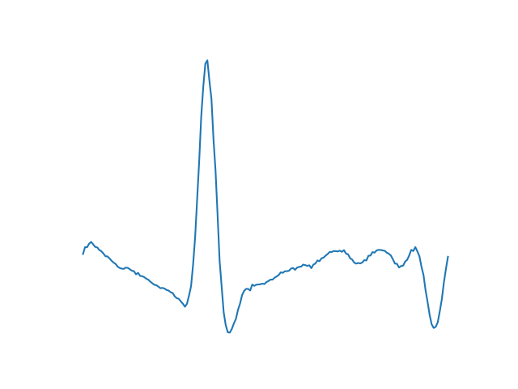
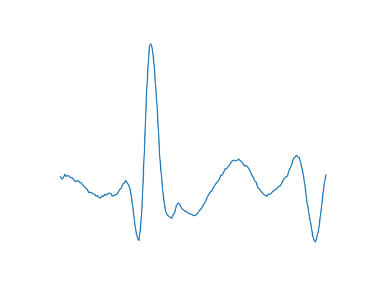 <br>
epoch 2000 <br>

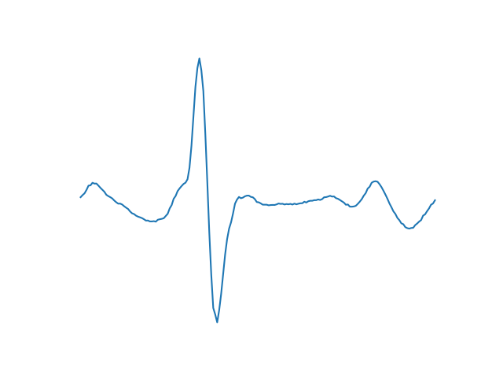
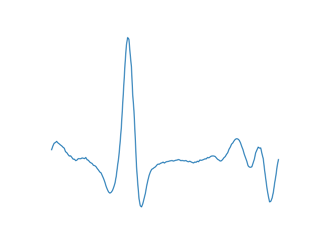 <br>